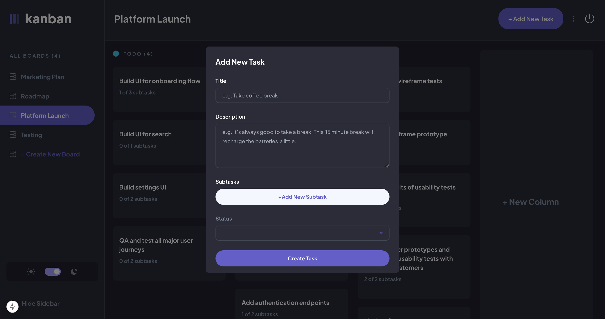

# Kanban task management web app

This is a solution to the [Kanban task management web app challenge on Frontend Mentor](https://www.frontendmentor.io/challenges/kanban-task-management-web-app-wgQLt-HlbB). Frontend Mentor challenges help you improve your coding skills by building realistic projects.

## Table of contents

- [Overview](#overview)
  - [The challenge](#the-challenge)
  - [Screenshot](#screenshot)
  - [Links](#links)
- [My process](#my-process)
  - [Built with](#built-with)
  - [What I learned](#what-i-learned)
- [Author](#author)

## Overview

### The challenge

Users are be able to:

- View the optimal layout for the app depending on their device's screen size
- See hover states for all interactive elements on the page
- Create, read, update, and delete boards and tasks
- Receive form validations when trying to create/edit boards and tasks
- Mark subtasks as complete and move tasks between columns
- Hide/show the board sidebar
- Toggle the theme between light/dark modes
- Drag and drop tasks to change their status and re-order them in a column
- Keep track of any changes, even after refreshing the browser
- Create an account using email and password

### Screenshot

### Links

- Solution URL: [https://github.com/12Ricky0/kanban-task-mgt.git](https://github.com/12Ricky0/kanban-task-mgt.git)
- Live Site URL: [Add live site URL here](https://your-live-site-url.com)

## My process

### Built with

- MongoDB
- bcrypt
- [Zod](https://zod.dev/) - For Form validatiion
- [DnD Kit](https://dndkit.com/) - For Drag and Drop
- [Next.js](https://nextjs.org/) - React framework
- [NextAuth](https://next-auth.js.org/) - For Authentication

### What I learned

Drag and Drop was something new for me so I struggled a bit with it but later got things up and running. In general it was
a great experience for me to be able to implement drag and drop functionality using DnD kit.

## Author

- Frontend Mentor - [@12Ricky0](https://www.frontendmentor.io/profile/12Ricky0)
- Instagram - [@temple4b](https://www.instagram.com/temple4b)
